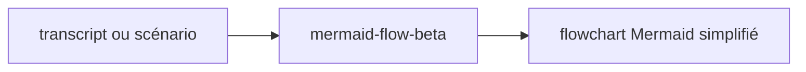

# mermaid-flow-beta

> Version expérimentale du skill mermaid-flow. Transformer un flow (texte, transcript, scénario, fichier markdown, mermaid existant ou image) en un flowchart Mermaid SIMPLIFIÉ pour parties prenantes et directeurs de compte (max 10 étapes, idéalement 7). Analyse en 3 passes (narrative, ambiguïtés noms propres, valeur vs bruit incluant la détection de scénarios imbriqués) avant génération. Préfère labels génériques (le chatbot, l'app) plutôt que noms propres de produits/équipes/clients — signale les ambiguïtés détectées. Quand la source mentionne un sous-flow distinct (FLOW 2, séquence alternative), propose de le référencer plutôt que de gaspiller des nodes. 5 variantes disponibles : linéaire, décision, boucle, référence externe, 2 chemins parallèles. Produit un fichier .md au format strict avec légende dynamique, palette pastel light-mode, emojis acteurs (👤 client, 🤖 IA, ⚙️ système, 🖥️ UI, ⚖️ décision). À invoquer quand l'utilisateur veut vulgariser un processus métier en diagramme accessible pour un plan de projet.

- **Créé** : `2026-05-15`
- **Dernière mise à jour** : `2026-05-15`



## Installation

```
/plugin marketplace add RunLittleTurtle/skills-beta
/plugin install mermaid-flow-beta@skills-beta
```

Slash : `/mermaid-flow-beta`. Mise à jour : `/plugin marketplace update skills-beta`.

## Licence

MIT — voir [LICENSE](../../LICENSE).
