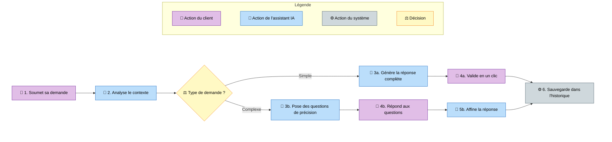

# Flow 3-S — Demande client traitée par le chatbot

> Le client soumet une demande au chatbot ; selon la complexité détectée, soit le chatbot répond directement, soit il pose des questions de précision avant de produire une réponse. Le résultat est ensuite sauvegardé dans l'historique de conversation.
>
> **Persona : Utilisateur qui consulte un chatbot pour obtenir une réponse rapide sans avoir à formuler tous les détails dès le départ.**

---

## Notes sur cet exemple

- **Variante 5 — 2 chemins parallèles** : deux sous-flux distincts (`Simple` 2 étapes / `Complexe` 3 étapes) qui convergent vers le même node `I`.
- **Label générique « le chatbot »** : nulle part dans le diagramme on ne voit le nom de l'agence ou du client. Si la source disait « le chatbot Mia analyse pour Authentik », la Passe B aurait détecté l'ambiguïté et proposé ce mapping.
- **Pas de 🖥️ UI** : aucun écran n'apparaît explicitement dans le flow. La légende dynamique omet donc `L4 uiAction` et renumérote `Décision` en `L4`.
- **Numérotation `3a/4a` et `3b/4b/5b`** : marque visuellement les deux branches, avec convergence sur `6` après réunion.
- **Labels descriptifs des branches** (`Simple` / `Complexe`) plutôt que `Oui` / `Non` : signal que c'est une variante 5, pas une variante 2.
