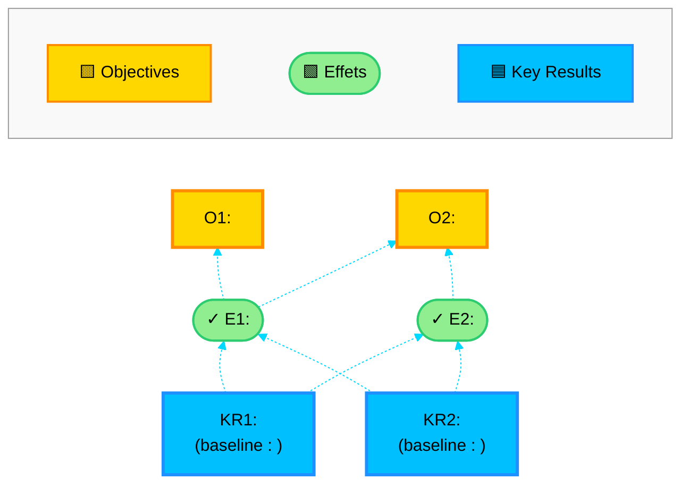

# product-brief v1 (archivé) — Product brief one-pager au format PRD Authentik

> **Note** : il s'agit de la version 1 archivée. La version active du skill se trouve sous le slug `product-brief`. Cette version reste accessible pour reproductibilité ou pour quiconque souhaite retomber sur le comportement original.

Aide l'utilisateur à transformer un ou plusieurs inputs hétérogènes (notes de Business Analyst, transcripts d'atelier, d'entrevue ou de comité, data points chiffrés, insights discovery, OKRs Authentik, contraintes budgétaires, brouillons markdown, images de whiteboard, PDFs, URLs Drive, idées verbales) en un product brief one-pager structuré au format strict du PRD Authentik. Le résultat est un fichier markdown court et dense — pas un document long — qui peut servir de point de départ pour un PRD complet.

**Réponds en français (Québec). Sois concis. Confirme chaque action en une phrase.**

---

## Étape 1 — Récupérer les inputs

### 1a. Inventaire des sources

L'utilisateur peut fournir **plusieurs inputs hétérogènes en même temps** (c'est le cœur de ce skill). Demande dans le chat (pas via AskUserQuestion pour rester souple) :

> *« Pour ce product brief, dis-moi ce que tu as comme matière : notes de Business Analyst, transcripts d'ateliers ou d'entrevues, data points chiffrés (baselines, conversion, volumes), insights discovery (avec ID + nom de source), OKRs déjà définis, contraintes budgétaires, brouillons markdown, PDFs, images de whiteboard, URLs Drive, ou simplement une idée verbale. Liste tout ce que tu as — je vais ingérer en parallèle. »*

Si l'utilisateur a passé un argument au slash command (fichier ou texte), commence par celui-là, puis demande si autre chose à ajouter.

### 1b. Ingestion par type

Lis chaque source via le tool adapté. En parallèle quand possible.

**Fichier markdown / texte local** : `Read` sur le fichier complet. Demande le path absolu si pas fourni.

**PDF** : `Read` sur le fichier. **Si plus de 10 pages**, paramètre `pages: "1-10"` puis itère par tranches de 10. Ne pas tenter de lire un gros PDF d'un coup.

**Image / screenshot** : `Read` (multimodal). Si l'image est ambiguë, demande à l'utilisateur de décrire textuellement ce qu'il voit. Ne pas inventer.

**Transcript (long fichier de transcription d'atelier ou d'entrevue)** : `Read` complet si raisonnable. Sinon `Read` par tranches avec `offset` + `limit`. Lors de l'analyse (Étape 2), cible spécifiquement les passages qui contiennent des chiffres, des verbatims sur le problème, ou des phrases qui pourraient devenir des insights citables.

**Texte collé dans le chat** : déjà dans le contexte, ne lis rien de plus.

**URL Google Drive** : si le MCP Drive est connecté, utilise `mcp__claude_ai_Google_Drive__read_file_content` (ou `download_file_content` pour les binaires). Sinon, demande à l'utilisateur de télécharger localement.

**Description verbale uniquement** : c'est valide mais signale à l'utilisateur que le brief sera moins étayé. Pose 3-5 questions ciblées pour combler les trous critiques (problème concret, budget approximatif, OKR pressenti). Ne génère JAMAIS sans au minimum : un problème nommé + un public/persona + une intuition de solution.

### 1c. Identifier le projet

Demande dans le chat si pas évident depuis les inputs :

> *« Quel est le nom du projet ? Numéro de projet (si applicable, ex: "Projet 4") ? Et le client/contexte (ex: Authentik) ? »*

---

## Étape 2 — Analyse profonde (interne)

Cette étape se fait **dans ta tête**, pas en sortie utilisateur. Identifie systématiquement les 7 blocs suivants. Si un bloc manque ou est faible dans les inputs, note-le comme « trou identifié » pour l'Étape 3 — pas de question gratuite si l'info est présente.

### Les 7 blocs à extraire

1. **Contexte & origine du besoin** — 1-2 phrases : d'où vient ce projet, sa place dans une stratégie plus large (phase 1/2/3, projet précédent, dépendance technique, opportunité de marché). Cherche dans les inputs des mentions de projets antérieurs, de fondations techniques, de moments stratégiques.

2. **Problème** — trois sous-blocs :
   - **Situation actuelle** : 1 paragraphe descriptif avec **chiffres baseline** (taux d'adoption, volume, conversion, coût, temps de réponse…). Les chiffres sont obligatoires si présents dans les inputs.
   - **Conséquences (2-3 bullets)** : impact concret du problème (perte de clients, sous-utilisation, coûts, frictions).
   - **Insights discovery citables (2-4)** : quotes verbatims tirées des transcripts / notes BA avec **ID + nom de la source** quand disponible. Format à respecter à l'Étape 5.

3. **Enveloppe & contraintes** — trois sous-éléments :
   - **Budget** : montant + monnaie + **ce qu'il couvre** (scope précis : moteur IA / backend / frontend ?) + **qui fait quoi** (équipe MIA vs équipe interne client).
   - **Temps** : durée de sprints, nombre approximatif, ou deadline.
   - **Pourquoi maintenant** : timing, dépendances livrées, fenêtre stratégique.

4. **Alignement stratégique (OKR)** — distingue trois niveaux qui doivent être chaînés causalement :
   - **Objectives (O1, O2…)** : objectifs stratégiques **du client** (Authentik ou autre), exprimés en métrique de haut niveau (CA/conseillère ↑, temps de réponse ↓).
   - **Effets (E1, E2…)** : conséquences intermédiaires attendues du projet (clients pré-qualifiés, revenus générés sans intervention).
   - **Key Results (KR1, KR2…)** : métriques **hybrides MIA/client** mesurant directement l'impact du projet (taux d'adoption, taux de conversion). Cherche les **baselines chiffrées** dans les inputs (transcripts, rapports cités).

5. **Solution proposée** — quatre sous-blocs :
   - **Solution (5.1)** : 2-3 paragraphes décrivant ce que le projet livre concrètement + **Note de scope** explicite (qui livre quoi, frontière MIA vs client).
   - **Job Stories Klement (5.2)** : 4-7 job stories au format strict **« Quand X, je veux Y, afin de Z »**. Couvre les principaux moments d'usage.
   - **Flows utilisateur (5.4)** : liste des flows envisagés, avec marquage `**[Flow retenu]**` pour ceux qui sont dans le scope v1 (les autres restent listés mais non gras).
   - **Impact AARRR (5.5)** : tableau funnel Acquisition / Activation / Retention / Referal / Revenue avec les actions utilisateur par étape.

6. **Out of scope** — 4-8 bullets nommant **explicitement** ce qui n'est PAS dans le projet (frontend, profiling avancé, réservation auto, crawlers externes, etc.). Chaque bullet : `**<titre court>** : <phrase explicative>`. Ce bloc est critique pour cadrer l'enveloppe.

7. **Risques** — 3-5 risques avec **mitigation explicite** pour chacun. Format : `**<titre du risque>** : <description>` puis sous-bullet `*Mitigation* : <action concrète>`.

### Règles d'extraction

- **Préserve les chiffres exactement** comme dans les inputs (taux, volumes, montants, deadlines). Ne pas arrondir, ne pas reformuler.
- **Préserve les noms propres** (personas, clients, outils concurrents, conseillères, cofondateurs cités).
- **Préserve les IDs d'insight** (« ID 70 », « ID 54 ») et les noms des sources (« Valérie Pin », « Simon Lemay »).
- **Ne fusionne pas** deux insights distincts en un seul, même s'ils se ressemblent.
- **Distingue Objectives vs Effets vs KRs** : si l'utilisateur mélange, sépare-les dans l'analyse.

---

## Étape 3 — Proposer le plan d'analyse et valider

Présente ton plan **en texte dans le chat** (pas dans la question — c'est plus lisible) :

> *« Plan d'analyse pour le product brief `<Nom du projet>` :*
>
> *- **Contexte & origine** : `<résumé 1 phrase>`*
> *- **Problème principal** : `<résumé 1 phrase>` avec baseline `<chiffres>`*
> *- **Insights retenus (`<N>`)** : `<ID + source>` ; `<ID + source>` ; …*
> *- **Budget** : `<montant>` (couvre `<scope>`)*
> *- **Temps** : `<durée>`*
> *- **Pourquoi maintenant** : `<résumé>`*
> *- **Objectives client** : O1 `<titre>` ; O2 `<titre>`*
> *- **Effets attendus** : E1 `<titre>` ; E2 `<titre>`*
> *- **Key Results** : KR1 `<métrique + baseline>` ; KR2 `<métrique + baseline>`*
> *- **Solution** : `<résumé 1 phrase>` (MIA livre `<X>`, `<équipe client>` livre `<Y>`)*
> *- **Job Stories (`<N>`)** : `<aperçu en 3-5 mots chacune>`*
> *- **Flows retenus** : `<liste>` ; **Flows écartés** : `<liste>`*
> *- **Out of scope (`<N>` items)** : `<liste courte>`*
> *- **Risques (`<N>`)** : `<titres>`*
> *- **Trous identifiés** : `<liste ou "aucun">`* »*

Puis utilise `AskUserQuestion` :

- **Question** : *« OK pour générer le product brief avec ce plan ? »*
- **Options** :
  - *« Oui, génère »* (Recommended) — procéder à la génération.
  - *« Ajuster »* — l'utilisateur précise via Other ce qu'il veut changer.
  - *« Annuler »* — sortir sans rien générer.

**Si Ajuster** : prends le feedback, retravaille l'analyse en interne, **reproposes** un nouveau plan avec un nouvel `AskUserQuestion`. Boucle jusqu'à validation explicite.

**Si trous identifiés (info critique manquante)** : pose 1 à 3 questions ciblées via `AskUserQuestion` AVANT de représenter le plan. Exemples :
- *« Le budget couvre-t-il aussi le frontend ou seulement le backend ? »*
- *« As-tu une baseline chiffrée pour le KR1 (taux d'adoption actuel) ? »*
- *« Quel est le persona principal du projet ? »*

---

## Étape 4 — Rédiger Section 1 : Contexte & origine du besoin

Format : **1 paragraphe** (max 4-5 lignes). Pas de bullets dans ce bloc.

Contenu attendu :
- D'où vient le projet (phase précédente, stratégie globale, projet parent).
- Ce qui le rend possible aujourd'hui (fondations techniques livrées, opportunité de marché).
- Ce qu'il représente dans l'écosystème (« première initiative de la Phase 2 », « extension du système X »).

Évite : la justification du problème (c'est Section 2), les détails de solution (c'est Section 5).

---

## Étape 5 — Rédiger Section 2 : Problème

Format strict :

```markdown
## 2. Problème

**Situation actuelle** : <1 paragraphe descriptif avec chiffres>. Cela se traduit par :

- **<Titre conséquence 1>** : <phrase explicative>.
- **<Titre conséquence 2>** : <phrase explicative>.

> *Insight discovery (ID <X> - <Nom source>)* : <citation verbatim>

> *Insight discovery (ID <Y> - <Nom source, rôle si pertinent>)* : <citation verbatim>

> *Insight discovery (ID <Z> - <Nom source>)* : <citation verbatim>
```

### Règles

- **Chiffres baseline obligatoires** dans le paragraphe d'intro s'ils sont dans les inputs (« utilisé par environ 4% de la clientèle », « 1300/34000 visites »).
- **2 à 3 bullets** de conséquences, avec titre en gras suivi de `:` et phrase explicative.
- **2 à 4 blockquotes d'insights**, chacun sur sa propre ligne avec ligne vide avant/après. Format strict : `> *Insight discovery (ID <X> - <Nom source>)* : <citation>`. Pas de citation sans ID/source — si l'insight n'a pas d'ID dans les inputs, mets-le sans ID mais conserve le nom.
- **Citation verbatim** — pas de reformulation, pas de raccourci, pas de paraphrase. Si la citation source est très longue (3+ phrases), coupe avec `[…]` plutôt que reformuler.

---

## Étape 6 — Rédiger Section 3 : Enveloppe & contraintes

Format strict :

```markdown
## 3. Enveloppe & contraintes

**Budget** : <montant> <monnaie>. <Ce qu'il couvre : scope MIA / scope client>. <Qui développe quoi : équipe MIA / équipe technique cliente / etc.>

**Temps** : <Sprints de N semaines>. <Nombre de sprints, ou "à déterminer lors du scoping">.

**Pourquoi maintenant** : <Paragraphe expliquant le timing : dépendances livrées, fenêtre stratégique, alignement organisationnel>.
```

### Règles

- 3 sous-titres en gras exactement : `**Budget**`, `**Temps**`, `**Pourquoi maintenant**`.
- Budget : préciser scope (souvent moteur IA / backend MIA vs frontend client) si applicable.
- Pas de bullets — paragraphes courts derrière chaque titre en gras.

---

## Étape 7 — Rédiger Section 4 : Alignement stratégique (OKR + diagramme Mermaid)

Format strict :

```markdown
## 4. Alignement stratégique

Les Key Results du Projet <N> (en bleu) sont alignés avec les objectifs d'affaire de <Client> (en jaune) et servent de métriques de succès. **Si les KR atteignent leurs cibles, cela contribuera nécessairement à la progression des Objectives <O1, O2...> de <Client>.**

#### Diagramme Causal OKR



#### Tableau OKR - Objectives & Key Results

*Les Objectives (O1, O2...) sont des objectifs stratégiques de <Client> pour <année>, influencés par de multiples facteurs organisationnels. Les Key Results (KR1, KR2...) sont des métriques de succès hybrides entre MIA Innovation et <Client>, mesurant directement l'impact du Projet <N>.*

*<Note baseline avec sources : transcripts, rapports, dates de référence>.*
```

### Règles strictes du diagramme

1. **`graph BT`** (Bottom-Top) — KRs en bas, Objectives en haut. Sens causal : KRs → Effets → Objectives.
2. **Couleurs imposées** :
   - KRs : `fill:#00bfff, stroke:#1e90ff` (bleu)
   - Effets : `fill:#90ee90, stroke:#2ecc71` (vert) + nœud rond `(["..."])`
   - Objectives : `fill:#ffd700, stroke:#ff8c00` (jaune)
3. **Liens en pointillé `-.->`** entre KRs → Effets et Effets → Objectives. Pas de flèches solides.
4. **Légende en subgraph `Legende[" "]`** avec `direction LR` et nœuds `L1`, `L2`, `L3`. Relier `O1 ~~~ Legende` et `O2 ~~~ Legende` (liaison invisible).
5. **Préserver le bloc `%%{init: ...}%%`** exactement comme dans le squelette — il définit le thème et les couleurs globales.
6. **Préfixes obligatoires** : `KR1:`, `E1:`, `O1:` dans les libellés. Avec `✓` pour les Effets (`✓ E1:`).
7. **Adapter le nombre de KRs / Effets / Objectives** au projet (typiquement 2 KRs, 2 Effets, 2 Objectives — mais peut varier de 1 à 4 chacun).
8. **Note baseline** en italique sous le tableau, citant les sources des chiffres (transcript X du JJ-MM-AAAA, rapport Y, etc.).

### Auto-vérification avant écriture

- Tous les nœuds ont un `style` correspondant à leur catégorie.
- Toutes les liaisons causales `KR -.-> E` et `E -.-> O` sont déclarées.
- La légende est reliée par `~~~` (lien invisible) aux Objectives.
- Le bloc `%%{init: ...}%%` est sur la première ligne du diagramme.

---

## Étape 8 — Rédiger Section 5 : Solution proposée

Format strict en 4 sous-sections :

### 5.1 Solution proposée

2-3 paragraphes décrivant **concrètement** ce que le projet livre. Premier paragraphe = description haut niveau du livrable. Deuxième paragraphe = comment l'utilisateur final interagit (UX). Puis :

```markdown
**Note** : <Phrase de scope explicite — qui développe quoi, frontière MIA vs équipe cliente>.
```

### 5.2 Besoins utilisateur (Job Stories)

```markdown
### 5.2 Besoins utilisateur (Job Stories)

Cette section capture les intentions du client en format Job Story (Klement). Le format `Quand X, je veux Y, afin de Z` exprime un besoin.

- **Job Story 1 (<étiquette courte>)** : Quand <contexte>, je veux <intention>, afin de <bénéfice>.
- **Job Story 2 (<étiquette courte>)** : Quand <contexte>, je veux <intention>, afin de <bénéfice>.
- ...
```

Règles :
- Entre 4 et 7 job stories typiquement.
- Format Klement strict — pas de variation (`je veux pouvoir`, `je veux qu'il`, `je veux que` sont tous acceptables comme verbe d'intention).
- Étiquette courte entre parenthèses pour chaque story (saisie naturelle, génération flexible, point de départ proposé, validation flexible…).
- Verbatim friendly : si une job story vient mot pour mot d'un transcript, garde la formulation.

### 5.4 Les flows utilisateurs possibles dans ce projet

```markdown
### 5.4 Les flows utilisateurs possibles dans ce projet

Flow <N> - <Titre du flow>

**[Flow retenu] Flow <N> - <Titre du flow retenu>**

Flow <N> - <Titre flow écarté>

**[Flow retenu] Flow <N> - <Titre du flow retenu> (flow principal/secondaire)**
```

Règles :
- Liste plate (pas de bullets).
- Marquer en gras `**[Flow retenu] Flow X - ...**` ceux du scope v1.
- Mentionner « (flow principal) » ou « (flow secondaire) » entre parenthèses si l'info est dans les inputs.
- Garder même les flows écartés dans la liste (pour traçabilité — ils ne sont juste pas en gras).

### 5.5 L'impact des flows sur le Funnel Pirate AARRR

```markdown
### 5.5 L'impact des flows sur le Funnel Pirate AARRR

*Notes : Les flows sont basés sur le funnel produit AARRR (the Pirate funnel : https://www.productplan.com/glossary/aarrr-framework/)*

| Étape funnel_____ |  | Actions utilisateur |
|---|---|---|
| **ACQUISITION** |  | <actions> |
| ▼ |  | |
| **ACTIVATION** |  | **<actions des flows retenus>** ; <autres actions> |
| ▼ |  | |
| **RETENTION** |  | <actions> |
| ▼ |  | |
| **REFERAL** |  | <actions> |
| ▼ |  | |
| **REVENUE** |  | <actions> |
```

Règles :
- Tableau à 3 colonnes (Étape funnel | flèche | Actions utilisateur).
- 5 étapes AARRR fixes : ACQUISITION, ACTIVATION, RETENTION, REFERAL, REVENUE — dans cet ordre.
- Lignes intercalaires `▼` entre chaque étape (esthétique funnel).
- Actions des flows retenus en gras dans la case ACTIVATION (au minimum).
- Lien externe vers productplan.com en italique au-dessus du tableau.

---

## Étape 9 — Rédiger Section 6 : Out of scope

Format :

```markdown
## 6. Out of scope

- **<Titre court>** : <Phrase explicative de ce qui n'est PAS dans le projet et pourquoi (ou qui le livre à la place)>.

- **<Titre court>** : <Phrase explicative>.

- ...
```

Règles :
- 4 à 8 bullets.
- Titre court en gras suivi de `:` puis phrase explicative.
- Couvrir typiquement : frontend / UI (si le projet est backend), profiling avancé / personnalisation historique, réservation automatique / booking, crawlers externes / sources non maîtrisées, flows additionnels reportés, alertes dynamiques (si statiques en v1), etc.
- Ligne vide entre chaque bullet pour la lisibilité (one-pager dense reste lisible).

---

## Étape 10 — Rédiger Section 7 : Risques

Format :

```markdown
## 7. Risques

- **<Titre du risque>** : <Description du risque>.
  - *Mitigation* : <Action concrète de mitigation>.

- **<Titre du risque 2>** : <Description>.
  - *Mitigation* : <Action concrète>.

- ...
```

Règles :
- 3 à 5 risques.
- Chaque risque : titre en gras + description + sous-bullet `*Mitigation*` en italique.
- Mitigation **concrète** (pas « bien gérer », mais « limiter à N par jour », « prioriser v1 sur flows X et Y », « évaluer ratio coût/performance »).

---

## Étape 11 — Assembler le fichier final

Ordre exact des sections (séparateurs `---` entre toutes les sections de premier niveau) :

```markdown
# Projet <N> - <Titre du projet> (Product Brief)

---

## 1. Contexte & origine du besoin

<contenu Étape 4>

---

## 2. Problème

<contenu Étape 5>

---

## 3. Enveloppe & contraintes

<contenu Étape 6>

---

## 4. Alignement stratégique

<contenu Étape 7 — paragraphe + diagramme Mermaid + tableau OKR>

---

## 5. Solution proposée

### 5.1 Solution proposée

<contenu Étape 8 partie 5.1>

### 5.2 Besoins utilisateur (Job Stories)

<contenu Étape 8 partie 5.2>

### 5.4 Les flows utilisateurs possibles dans ce projet

<contenu Étape 8 partie 5.4>

### 5.5 L'impact des flows sur le Funnel Pirate AARRR

<contenu Étape 8 partie 5.5>

---

## 6. Out of scope

<contenu Étape 9>

---

## 7. Risques

<contenu Étape 10>
```

**Notes de format** :
- Le titre H1 suit le pattern `# Projet <N> - <Titre> (Product Brief)` (espace simple autour du tiret, pas de tiret cadratin).
- Les séparateurs `---` sont sur leur propre ligne, entourés de lignes vides.
- Aucune section 5.3 (volontaire dans le gabarit Authentik — la numérotation 5.1, 5.2, 5.4, 5.5 est intentionnelle, ne pas renuméroter).
- Le brief reste **un one-pager dense** — vise 1.5 à 3 pages imprimées maximum. Si l'analyse Étape 2 produit beaucoup plus, propose à l'utilisateur de simplifier (réduire le nombre de job stories, de flows, d'insights) avant d'écrire.

---

## Étape 12 — Sauvegarder et confirmer

### 12a. Déterminer l'emplacement

Construis un chemin par défaut selon l'origine des inputs :

- **Input principal = fichier dans un dossier PRD** (chemin contient `PRD_`, `prd_`, `Roadmap_projets`, `product_brief`) : suggère le **même dossier**, nom `product_brief_v<N>.md` où `<N>` = prochain numéro de version libre (regarde s'il y a déjà des `product_brief_v1.md`, `product_brief_v2.md`, etc.).
- **Input principal = fichier ailleurs** : suggère le dossier de l'input, même convention de nom.
- **Input = texte / image / transcripts collés dans le chat sans fichier** : suggère `~/Desktop/product_brief_<slug_projet>_v1.md`.

`<slug_projet>` = nom du projet en kebab-case sans accents (ex: « Projet 4 - Générateur de Road Trip IA » → `projet-4-roadtrip` ou `projet_4_roadtrip`).

### 12b. Confirmation et écriture

Utilise `AskUserQuestion` :

- **Question** : *« Sauvegarder à `<chemin proposé>` ? »*
- **Options** :
  - *« Oui »* (Recommended) — `Write` au chemin proposé.
  - *« Changer le chemin »* — l'utilisateur saisit un path absolu via Other.

Après écriture, confirme en une phrase :

> *« Product brief sauvegardé dans `<path>`. <N> insights, <K> job stories, <F> flows (<Fr> retenus), <R> risques. »*

**Une seule fois** (pas à chaque appel), suggère :

> *« Pour valider le rendu Mermaid : copie le bloc dans https://mermaid.live ou ouvre le fichier dans GitHub / Obsidian. »*

---

## Règles invariantes du format

1. **Langue** : français Québec en sortie. Si les inputs sont en anglais, traduis. Préserve les anglicismes business courants (chat, dashboard, UI, road trip, RAG, persona).
2. **Titre H1** : exactement `# Projet <N> - <Titre> (Product Brief)`. Si pas de numéro de projet, omets « Projet <N> - » et utilise `# <Titre> (Product Brief)`.
3. **Séparateurs `---`** : sur leur propre ligne entre toutes les sections de premier niveau (numérotées 1 à 7).
4. **Sections obligatoires et dans cet ordre** : 1. Contexte & origine du besoin, 2. Problème, 3. Enveloppe & contraintes, 4. Alignement stratégique, 5. Solution proposée (avec 5.1, 5.2, 5.4, 5.5 — pas de 5.3), 6. Out of scope, 7. Risques. Aucune section n'est optionnelle.
5. **Insights en blockquote** : format strict `> *Insight discovery (ID <X> - <Nom source>)* : <citation>`, ligne vide avant et après chaque blockquote.
6. **Diagramme OKR Mermaid** : obligatoire en Section 4, avec couleurs imposées (KRs bleu, Effets vert avec `✓` et nœud rond, Objectives jaune), liens `-.->`, légende en subgraph, bloc `%%{init: ...}%%` sur première ligne.
7. **Job Stories** : format Klement strict « Quand X, je veux Y, afin de Z », étiquette courte entre parenthèses, 4 à 7 stories.
8. **Flows** : liste plate avec marquage `**[Flow retenu] Flow N - Titre**` en gras pour ceux du scope v1.
9. **Tableau AARRR** : 5 étapes fixes (ACQUISITION → ACTIVATION → RETENTION → REFERAL → REVENUE), lignes intercalaires `▼`, lien externe productplan en italique.
10. **Out of scope** : 4 à 8 bullets avec titre en gras + phrase, ligne vide entre chaque.
11. **Risques** : 3 à 5 risques avec mitigation explicite en sous-bullet italique.
12. **Aucune section ajoutée hors gabarit** : pas de KPI techniques, pas de stack, pas de spec API, pas de roadmap détaillée. Si l'utilisateur en demande, c'est hors scope du product brief one-pager (c'est un PRD complet ou un document technique séparé).
13. **One-pager dense** : 1.5 à 3 pages max. Vise la densité, pas la longueur.

---

## Règles de comportement

- **Ne jamais générer le fichier sans validation explicite** de l'utilisateur (Étape 3 obligatoire).
- **Ne jamais inventer** un chiffre, un insight, un nom de persona, un OKR si les inputs sont ambigus ou silencieux — demande à l'utilisateur via `AskUserQuestion`.
- **Ne jamais reformuler** les citations d'insights — verbatim obligatoire, ou coupe avec `[…]`.
- **Ne jamais fusionner** deux insights distincts en un seul.
- **Ne jamais renuméroter** les sous-sections (la 5.3 absente est volontaire dans le gabarit Authentik).
- **Ne jamais commit automatiquement** le fichier généré. L'utilisateur décide.
- **Ne jamais ajouter de section** hors du gabarit strict (préconditions, KPI techniques, etc.) sans demande explicite.
- **Réponds en français Québec.** Concis. Une phrase pour confirmer une action.
- **Inputs multiples = ingestion parallèle** : si l'utilisateur fournit 3 fichiers + 1 transcript + 1 image, fais les `Read` en parallèle dans un seul tour (sauf pour les PDFs longs qu'il faut paginer).
- **Trace les sources** : note dans ton analyse interne d'où vient chaque chiffre / insight / OKR. Si l'utilisateur demande « d'où vient le chiffre 4% ? » après génération, tu dois pouvoir répondre.
- **One-pager > exhaustivité** : si tu hésites entre 7 et 12 job stories, prends 6. Si tu hésites entre 4 et 8 risques, prends 4. La densité bat la longueur.
- **Si l'utilisateur veut s'écarter du format strict** (ajouter une section, retirer le diagramme OKR, changer les couleurs Mermaid), **préviens** que ça casse la cohérence avec les autres briefs du PRD Authentik, mais accepte si insistance.
- **Si les inputs sont trop maigres** (juste « j'ai une idée vague d'un outil X »), refuse poliment et demande au minimum : problème nommé + persona + intuition de solution + une fourchette de budget. Sans ces 4 éléments, le brief n'a pas de matière.
