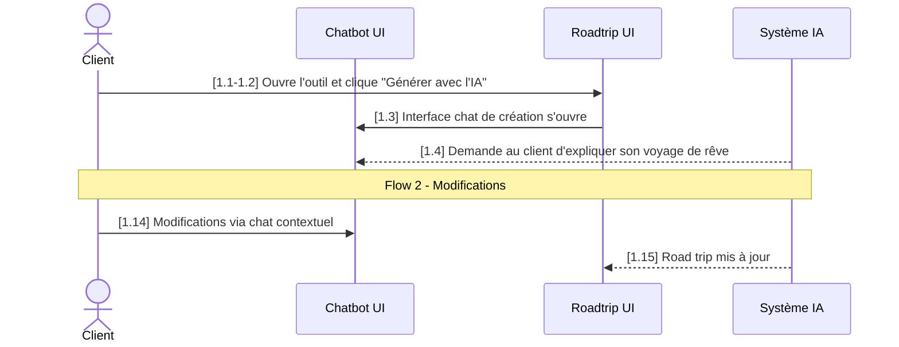

# scenario-uc-v1-beta — Scénario use-case au format PRD Authentik

Aide l'utilisateur à transformer n'importe quel input (texte brut, brouillon markdown, PDF, image de whiteboard, URL Drive, conversation, transcription, idée verbale) en un fichier markdown de scénario d'use-case au format strict Authentik : titre, description avec acteurs typés, intent business, séquence textuelle numérotée, et diagramme de séquence Mermaid.

**Réponds en français. Sois concis. Confirme les actions en une phrase.**

---

## Étape 1 — Récupérer l'input

### 1a. Identifier le type d'input

Si l'utilisateur a passé un argument au slash command, utilise-le. Sinon, demande dans le chat (pas via AskUserQuestion) :

> *« Tu veux convertir quoi ? Un fichier (md, pdf, image), une URL Drive, du texte que tu colles ici, ou une description verbale du flow ? »*

### 1b. Ingestion par type

**Fichier markdown / texte local** : demande le path absolu si pas fourni. Utilise `Read` sur le fichier complet.

**PDF** : `Read` sur le fichier. **Si plus de 10 pages**, paramètre `pages: "1-10"` puis itère par tranches. Ne pas tenter de lire un gros PDF d'un coup (échec garanti).

**Image / screenshot** : `Read` (multimodal). Si l'image est ambiguë (texte flou, schéma partiel), demande à l'utilisateur de **décrire textuellement** ce qu'il voit dans le chat. Ne pas inventer.

**Texte collé dans le chat** : déjà dans le contexte conversationnel, ne lis rien de plus.

**URL Google Drive** : si le MCP Drive est connecté, utilise `mcp__claude_ai_Google_Drive__read_file_content`. Sinon, dis à l'utilisateur de télécharger le fichier localement et de te donner le path.

**Description verbale** : pose 2-3 questions ciblées pour combler les trous (acteur principal, déclencheur, étapes clés). Ne génère JAMAIS sans ces 3 éléments minimum.

---

## Étape 2 — Analyse profonde (interne)

Cette étape se fait **dans ta tête**, pas en sortie utilisateur. Identifie systématiquement les 9 éléments suivants. Si un élément manque clairement dans l'input, prépare une question ciblée pour l'étape 3 — pas de question gratuite si l'info est présente.

### Éléments à extraire

1. **Nom du cas d'utilisation** — verbe d'action + objet (« Générer un road trip à partir de zéro », « Modifier un itinéraire existant », « Réserver un séjour Authentik »). Format : phrase nominale courte.

2. **Numéro de Flow** — entier (1, 2, 3…). Si l'input ne le précise pas, demande, ou propose le prochain numéro libre dans le dossier cible.

3. **Acteur principal** — UN seul humain (`Client`, `Conseillère`, `Admin`, `Coordinatrice`). Le rôle qui prend les décisions et qui voit le scénario aboutir. Pas un système.

4. **Acteurs secondaires (participants)** — UI (panneaux, fenêtres, modals), systèmes (Système IA, Sherpa, RAG), services tiers. 2 à 5 participants typiques. Distingue UI vs Système : `Roadtrip UI` est différent de `Système IA`.

5. **Événement déclencheur** — l'action concrète qui ouvre le scénario (« Le client clique sur le bouton X », « La conseillère ouvre la fiche Y »).

6. **Événement de fin** — l'état final attendu, observable (« Le road trip est affiché avec les boutons Réserver / Contacter », « L'email est envoyé au client »).

7. **Intent business** — pourquoi ce flow existe. 3 sous-éléments :
   - **Pain point actuel** : que fait le client/utilisateur aujourd'hui sans ce flow ? (« se rabat sur Roadtrippers », « attend 48h une réponse email »…)
   - **Gain visé** : qu'est-ce que ce flow apporte de neuf ?
   - **Expérience cible** : à quoi ressemble le moment vécu côté utilisateur (interface familière, rapidité, autonomie…) ?

8. **Liste ordonnée des étapes** — chaque étape = action explicite avec sujet (« Le client clique… », « Le Système IA affiche… », « Le Roadtrip UI ouvre… »). Préserve les détails (boutons nommés exactement, options listées). Numérotation 1.1, 1.2, … pour le flow principal.

9. **Flows secondaires** — un scénario peut contenir un flow secondaire (modification après génération, annulation après réservation, etc.). Repère les transitions narratives (« Puis, plus tard… », « Si le client veut modifier… »). Chaque flow secondaire a son propre titre en majuscules dans la séquence textuelle (ex: `FLOW 2 DE MODIFICATION`) et sa propre `Note over` dans le diagramme.

### Distinction critique : UI vs Système

- **UI** = quelque chose qui s'affiche à l'utilisateur (`Roadtrip UI`, `Chatbot UI`, `Dashboard UI`, `Modal de confirmation`).
- **Système** = backend invisible / logique IA (`Système IA`, `RAG`, `Sherpa ERP`, `Service de paiement`).

Une même responsabilité métier peut être découpée en UI + Système (ex: l'IA génère → `Système IA`, et l'affichage se fait dans le `Roadtrip UI`).

---

## Étape 3 — Proposer le plan d'analyse et valider

Présente ton plan d'analyse **en texte dans le chat** (pas dans la question — c'est plus lisible) :

> *« Plan d'analyse pour le scénario `<Nom>` (Flow `<N>`) :*
>
> *- **Acteur principal** : `<X>`*
> *- **Participants** : `<UI1>`, `<UI2>`, `<Système>`*
> *- **Déclencheur** : `<phrase>`*
> *- **Fin** : `<phrase>`*
> *- **Intent retenu** : `<résumé 1 phrase>`*
> *- **Étapes principales** (`<K>`) :*
>   *1.1 `<acteur>` `<action courte>`*
>   *1.2 `<acteur>` `<action courte>`*
>   *... (toutes les étapes du flow principal)*
> *- **Flow secondaire** (si applicable, `<P>` étapes) : `<titre>`*
> *- **Trous identifiés** : `<liste ou "aucun">`* »*

Puis utilise `AskUserQuestion` :

- **Question** : *« OK pour générer le scénario avec ce plan ? »*
- **Options** :
  - *« Oui, génère »* (Recommended) — procéder à la génération avec le plan ci-dessus
  - *« Ajuster »* — l'utilisateur précise via Other ce qu'il veut changer (acteurs, étapes, intent, etc.)
  - *« Annuler »* — sortir du skill sans rien générer

**Si Ajuster** : prends le feedback, retravaille en interne, **reproposes** un nouveau plan avec un nouvel `AskUserQuestion`. Boucle jusqu'à validation explicite.

**Si Annuler** : termine le skill avec *« Génération annulée. »*

**Si trous identifiés (info manquante)** : pose 1 à 3 questions ciblées via `AskUserQuestion` AVANT de représenter le plan. Exemples :
- *« Quel est l'événement de fin précis ? »*
- *« Le client peut-il interrompre le flow en cours ? Si oui à quel moment ? »*
- *« Y a-t-il un fallback si le système IA échoue ? »*

---

## Étape 4 — Rédiger l'Intent

L'Intent est 2-4 paragraphes business. Structure recommandée :

**Paragraphe 1** : pain point actuel + outils concurrents que ce flow remplace (Roadtrippers, ChatGPT, processus manuel, attente conseillère…). Ce que perd actuellement le client/l'entreprise.

**Paragraphe 2** : ce que ce flow apporte concrètement (résultat tangible en X minutes, autonomie, qualité, conformité aux guidelines).

**Paragraphe 3** (si pertinent) : l'expérience cible côté utilisateur — interface familière (chat type Claude/ChatGPT), feedback progressif, engagement maintenu.

**Paragraphe 4** (si pertinent) : ce qui se passe après — alternatives proposées, options de comparaison, parcours suivant.

**Style** :
- Ton concret, pas marketing.
- Pas de bullet points dans l'Intent (paragraphes pleins).
- Mentionne des noms réels (Roadtrippers, Authentik, ChatGPT) si présents dans l'input.
- Si l'input ne contient pas assez pour rédiger, demande à l'utilisateur les 3 éléments via `AskUserQuestion` (pain / gain / expérience).

---

## Étape 5 — Générer la séquence textuelle (section A)

### Format strict

```
## A. Scénarios (descriptions textuelles)

### Séquence normale

1.1. <Sujet explicite> <verbe> <complément>.

1.2. <Sujet explicite> <verbe> <complément>.

...
```

### Règles

- **Sujet explicite** dans chaque étape : « Le client », « Le Système IA », « Le Roadtrip UI », « La conseillère ». Jamais d'implicite (« il », « ça »).
- **Verbe au présent**, voix active.
- **Une phrase par étape**, courte mais avec les détails-clés (boutons exactement nommés, options listées, conditions).
- **Numérotation 1.1, 1.2, …** pour le flow principal. **Préserve les sauts** si le brouillon source en a (ex: 1.4 puis 1.6 — ne pas renuméroter, ça casse la traçabilité).
- **Ligne vide entre chaque étape** (pas une liste compacte).
- **Pas de bullet points** à l'intérieur d'une étape : si beaucoup de détails, utilise des virgules ou des parenthèses.

### Flows secondaires

Si un flow secondaire existe, insère un **séparateur en majuscules** dans la séquence textuelle, puis continue la numérotation :

```
1.13. Le client consulte le détail de chaque étape (jour par jour) pour valider.

FLOW 2 DE MODIFICATION

1.14. Le client effectue des modifications via le chat contextuel...
```

Le séparateur reste en `1.X` (continuité narrative dans le même fichier). Si le flow secondaire mérite un fichier séparé, c'est une autre invocation du skill (Flow 2 dédié, `2.1, 2.2, …`).

---

## Étape 6 — Générer le diagramme de séquence Mermaid (section B)

### Squelette strict

````markdown
## B. Scénarios (diagrammes de séquence)

### Séquence normale

```mermaid
sequenceDiagram
    actor <ActeurPrincipal>
    participant <Alias1> as <Nom long 1>
    participant <Alias2> as <Nom long 2>
    participant <Alias3> as <Nom long 3>

    <Acteur>->><Cible>: [1.1-1.2] <message>
    <Cible>->><Autre>: [1.3] <message>
    <Système>-->><Cible>: [1.4] <message>
    ...
    Note over <A>,<B>: Flow N - <Titre>
    <Acteur>->><Cible>: [N.X] <message>
    ...
```
````

### Règles strictes du diagramme

1. **Acteur principal** déclaré avec `actor <Nom>` (humanoid icon Mermaid). Un seul acteur principal par diagramme.
2. **Participants** déclarés avec `participant <Alias> as <Nom long>`. Aliases courts (`Chatbot`, `Roadtrip`, `SI`) — utilisés ensuite dans les flèches.
3. **Ligne vide** après les déclarations, avant la première flèche.
4. **Flèches** :
   - `->>` (solide) : action de l'utilisateur ou message synchrone qui change un état.
   - `-->>` (pointillée) : réponse du système / affichage / résultat asynchrone.
5. **Préfixe `[X.Y]` ou `[X.Y-X.Z]`** dans **chaque** message. C'est le pont avec la séquence textuelle. Si un message en mermaid couvre plusieurs étapes textuelles consécutives, utilise la plage : `[1.1-1.2]`.
6. **Message court** (5-12 mots typiquement). Détails techniques entre parenthèses si nécessaire. Garde le sens, pas chaque mot.
7. **`Note over A,B: Flow N - <Titre>`** à chaque transition de flow secondaire. Place-la juste avant les messages du flow secondaire.
8. **Pas de `loop`, `alt`, `opt`, `par`** dans le diagramme v1 du skill — on garde la séquence linéaire (les branches sont décrites dans la prose textuelle). Si l'input force des branches, mentionne-le et propose une v2 ou un second diagramme.

### Exemple de référence (extrait du gabarit Authentik)



### Auto-vérification avant écriture

Avant d'écrire le bloc mermaid, vérifie mentalement :
- Chaque émetteur ET destinataire est déclaré (actor ou participant).
- Chaque message a un préfixe `[X.Y]`.
- Les transitions de flow ont une `Note over`.
- Les aliases utilisés dans les flèches sont ceux déclarés (pas le `Nom long`).

---

## Étape 7 — Assembler le fichier final

Ordre exact (séparateurs `---` entre toutes les sections de premier niveau) :

```markdown
# Scénario du cas d'utilisation « <Nom> » (Flow <N>)


---

## Description du cas d'utilisation

<paragraphe d'intro 1-3 phrases : ce que couvre ce cas d'utilisation, contexte projet>

- **Événement qui déclenche le cas d'utilisation** : <phrase>
- **Événement qui met fin au cas d'utilisation** : <phrase>
- **Acteurs** :
  - **<Acteur principal>** (acteur principal) : <rôle 1 phrase>
  - **<Participant 1>** : <rôle 1 phrase>
  - **<Participant 2>** : <rôle 1 phrase>
  - **<Système>** : <rôle 1 phrase>

---

## Intent

<paragraphe 1 — pain point + outils concurrents>

<paragraphe 2 — gain concret>

<paragraphe 3 — expérience cible (si pertinent)>

---

## A. Scénarios (descriptions textuelles)

### Séquence normale

1.1. <étape>

1.2. <étape>

...

[FLOW 2 ... si applicable]

1.X. <étape flow secondaire>

---

## B. Scénarios (diagrammes de séquence)

### Séquence normale

```mermaid
<bloc mermaid validé à l'étape 6>
```
```

**Note** : il y a 2 lignes vides juste après le titre H1 dans le gabarit source — préserve cette particularité (cosmétique mais reproduit le format exact).

---

## Étape 8 — Sauvegarder et confirmer

### 8a. Déterminer l'emplacement

Construis un chemin par défaut selon l'origine de l'input :

- **Input = fichier dans un dossier PRD** (chemin contient `PRD_`, `prd_`, `Roadmap_projets`, `scenarios`) : suggère le **même dossier**, nom `scenario_<N>_<slug>_v1.md`. Ex : si input est `.../PRD_projet_4/old_draft.md` → `.../PRD_projet_4/scenario_<N>_<slug>_v1.md`.
- **Input = fichier ailleurs** : suggère le dossier de l'input, même convention de nom.
- **Input = texte/image collé dans le chat** : suggère `~/Desktop/scenario_<N>_<slug>_v1.md`.

`<slug>` = nom du cas en kebab-case sans accents (ex: « Générer un road trip à partir de zéro » → `creation_zero` ou `generer_roadtrip_zero`).

### 8b. Confirmation et écriture

Utilise `AskUserQuestion` :

- **Question** : *« Sauvegarder à `<chemin proposé>` ? »*
- **Options** :
  - *« Oui »* (Recommended) — `Write` au chemin proposé.
  - *« Changer le chemin »* — l'utilisateur saisit un path absolu via Other.

Après écriture, confirme en une phrase :

> *« Scénario sauvegardé dans `<path>`. <K> étapes flow principal, <P> étapes flow secondaire, <Q> participants. »*

**Une seule fois** (pas à chaque appel), suggère :

> *« Pour valider le rendu Mermaid : copie le bloc dans https://mermaid.live ou ouvre le fichier dans GitHub / Obsidian. »*

---

## Règles invariantes du format

1. **Langue** : français (Canada) toujours en sortie. Si l'input est en anglais, traduis. Préserve les anglicismes business courants (chat, road trip, dashboard, UI).
2. **Titre H1** : exactement `# Scénario du cas d'utilisation « <Nom> » (Flow <N>)` — guillemets français `« »` (avec espaces insécables idéalement, mais espaces simples acceptés).
3. **Séparateurs** : `---` sur sa propre ligne entre toutes les sections de premier niveau (`## ...`).
4. **Sections** : exactement, dans cet ordre — `Description du cas d'utilisation`, `Intent`, `A. Scénarios (descriptions textuelles)`, `B. Scénarios (diagrammes de séquence)`. Aucune section n'est optionnelle.
5. **Description** : commence par un paragraphe d'intro, suivi des 3 bullets `**Événement qui déclenche...**`, `**Événement qui met fin...**`, `**Acteurs**`. Acteurs en sous-bullets avec `**<Nom>** (acteur principal) : <rôle>` pour le premier, `**<Nom>** : <rôle>` pour les autres.
6. **Intent** : paragraphes pleins, pas de bullets, 2 à 4 paragraphes.
7. **Numérotation textuelle** : `1.1, 1.2, …` flow principal. Sauts de numérotation préservés si présents dans l'input (signal volontaire).
8. **Mermaid** : langage `mermaid`, type `sequenceDiagram`, `actor` pour humain, `participant` pour le reste, flèches `->>` / `-->>`, préfixes `[X.Y]` obligatoires, `Note over` pour transitions.
9. **Aucune section ajoutée hors gabarit** : pas de préconditions, postconditions, cas d'erreur, scénarios alternatifs nommés (sauf flow secondaire dans le même fichier). Si l'utilisateur en demande, c'est une v2 du skill.

---

## Règles de comportement

- **Ne jamais générer le fichier sans validation explicite** de l'utilisateur (étape 3 obligatoire).
- **Ne jamais inventer** un acteur, une étape, un Intent si l'input est ambigu — demande à l'utilisateur via `AskUserQuestion`.
- **Ne jamais renuméroter** les étapes si le source a des sauts (1.4 → 1.6) — c'est volontaire chez l'auteur.
- **Ne jamais commit automatiquement** le fichier généré. L'utilisateur décide.
- **Ne jamais ajouter de section** hors du gabarit strict (préconditions, postconditions, etc.) sans demande explicite.
- **Réponds en français.** Concis. Une phrase pour confirmer une action.
- Si l'utilisateur veut s'écarter du format strict (« ajoute des préconditions », « change la numérotation »), **préviens** que ça casse la cohérence avec les autres scénarios du PRD, mais accepte si insistance.
- Si tu détectes plusieurs flows distincts dans l'input qui mériteraient des fichiers séparés, **propose** de générer un fichier par flow plutôt que de tout fusionner — le client peut accepter ou refuser.
