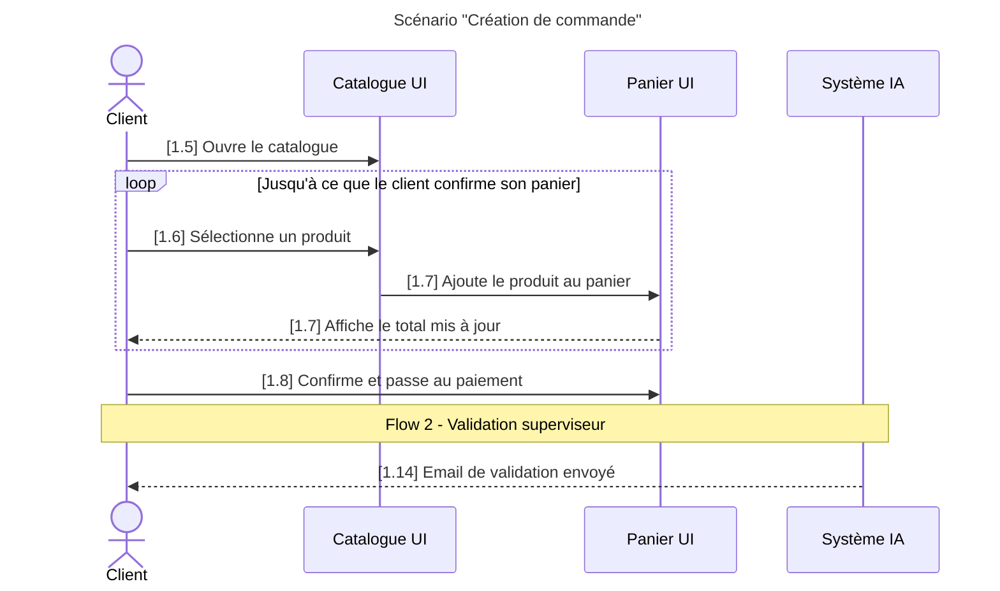

# scenario-uc-v2-beta — Scénario use-case PRD avec alternatives HEC, boucles et validation interactive

Aide l'utilisateur à transformer n'importe quel input (texte brut, brouillon markdown, PDF, image de whiteboard, URL Drive, conversation, transcription, idée verbale) en un fichier markdown de scénario d'use-case au format strict Authentik : titre avec préfixe AS-IS / TO-BE, description avec acteurs typés, intent business, séquence textuelle numérotée (avec séquences alternatives au format HEC et boucles LOOP/FIN LOOP si applicable), et diagramme de séquence Mermaid (avec titre frontmatter et `loop ... end` aligné sur le texte).

**Réponds en français. Sois concis. Confirme les actions en une phrase.**

---

## Étape 1 — Récupérer l'input

### 1a. Identifier le type d'input

Si l'utilisateur a passé un argument au slash command, utilise-le. Sinon, demande dans le chat (pas via AskUserQuestion) :

> *« Tu veux convertir quoi ? Un fichier (md, pdf, image), une URL Drive, du texte que tu colles ici, ou une description verbale du flow ? »*

### 1b. Ingestion par type

**Fichier markdown / texte local** : demande le path absolu si pas fourni. Utilise `Read` sur le fichier complet.

**PDF** : `Read` sur le fichier. **Si plus de 10 pages**, paramètre `pages: "1-10"` puis itère par tranches. Ne pas tenter de lire un gros PDF d'un coup (échec garanti).

**Image / screenshot** : `Read` (multimodal). Si l'image est ambiguë (texte flou, schéma partiel), demande à l'utilisateur de **décrire textuellement** ce qu'il voit dans le chat. Ne pas inventer.

**Texte collé dans le chat** : déjà dans le contexte conversationnel, ne lis rien de plus.

**URL Google Drive** : si le MCP Drive est connecté, utilise `mcp__claude_ai_Google_Drive__read_file_content`. Sinon, dis à l'utilisateur de télécharger le fichier localement et de te donner le path.

**Description verbale** : pose 2-3 questions ciblées pour combler les trous (acteur principal, déclencheur, étapes clés). Ne génère JAMAIS sans ces 3 éléments minimum.

---

## Étape 2 — Analyse profonde (interne)

Cette étape se fait **dans ta tête**, pas en sortie utilisateur. Identifie systématiquement les 10 éléments suivants. Si un élément manque clairement dans l'input, prépare une question ciblée pour l'étape 3 — pas de question gratuite si l'info est présente.

### Éléments à extraire

1. **Mode d'analyse** — **AS-IS** (état actuel du processus existant) ou **TO-BE** (solution future / processus cible après transformation). Convention BABOK classique. Si l'input n'est pas explicite, c'est une question bloquante de l'étape 3 (le préfixe du H1 et le nom de fichier en dépendent directement).

2. **Nom du cas d'utilisation** — verbe d'action + objet (« Générer un road trip à partir de zéro », « Modifier un itinéraire existant », « Réserver un séjour Authentik »). Format : phrase nominale courte.

3. **Numéro de version du scénario** `<N>` — entier (1, 2, 3…). Sert à former le préfixe `AS-IS_v<N>` ou `TO-BE_v<N>`. Si l'input ne le précise pas, demande ou propose le prochain numéro libre dans le dossier cible.

4. **Acteur principal** — UN seul humain (`Client`, `Conseillère`, `Admin`, `Coordinatrice`). Le rôle qui prend les décisions et qui voit le scénario aboutir. Pas un système.

5. **Acteurs secondaires (participants)** — UI (panneaux, fenêtres, modals), systèmes (Système IA, Sherpa, RAG), services tiers. 2 à 5 participants typiques. Distingue UI vs Système : `Roadtrip UI` est différent de `Système IA`.

6. **Événement déclencheur** — l'action concrète qui ouvre le scénario (« Le client clique sur le bouton X », « La conseillère ouvre la fiche Y »).

7. **Événement de fin** — l'état final attendu, observable (« Le road trip est affiché avec les boutons Réserver / Contacter », « L'email est envoyé au client »).

8. **Intent business** — pourquoi ce flow existe. 3 sous-éléments :
   - **Pain point actuel** : que fait le client/utilisateur aujourd'hui sans ce flow ? (« se rabat sur Roadtrippers », « attend 48h une réponse email »…)
   - **Gain visé** : qu'est-ce que ce flow apporte de neuf ?
   - **Expérience cible** : à quoi ressemble le moment vécu côté utilisateur (interface familière, rapidité, autonomie…) ?

9. **Liste ordonnée des étapes** — chaque étape = action explicite avec sujet (« Le client clique… », « Le Système IA affiche… », « Le Roadtrip UI ouvre… »). Préserve les détails (boutons nommés exactement, options listées). Numérotation `N.1, N.2, …` où `N` est le numéro de scénario (cohérent avec le préfixe `AS-IS_v<N>` / `TO-BE_v<N>`).

10. **Flows secondaires, séquences alternatives ET boucles** — un scénario peut contenir des phases additionnelles :

    - **Flows secondaires** (modification après génération, annulation après réservation, etc.) — repère les transitions narratives (« Puis, plus tard… », « Si le client veut modifier… »). Chaque flow secondaire a son propre titre en majuscules dans la séquence textuelle (ex: `FLOW 2 DE MODIFICATION`) et sa propre `Note over` dans le diagramme.

    - **Séquences alternatives (conventions HEC TECH 30710)** — repère les conditions de branchement à une étape donnée (« si > 5000 $ », « si client non connecté », « si fallback »). Numérotation : l'étape qui bifurque conserve son numéro (`1.3`), les sous-étapes de la branche se suffixent par lettre (`1.3a, 1.3b, 1.3c`). Plusieurs branches alternatives à la même étape = chacune dans sa propre section `* Séquence alternative`. Convention de retour obligatoire : `Retourne à l'étape X.Y de la séquence normale` ou `Termine le scénario`.

    - **Boucles (itérations)** — repère toute phase qui se répète jusqu'à une condition (« pour chaque produit du panier », « tant que l'utilisateur ajoute des items », « jusqu'à confirmation »). Identifie la **condition de sortie exacte** (mot pour mot, car elle doit matcher le `loop ... end` Mermaid) et les étapes itératives à inclure dans le bloc. À noter que HEC officiel utilise une formulation prose implicite (« répète l'étape X ») ; cette v2 adopte une convention plus explicite `LOOP / FIN LOOP` pour permettre un alignement strict avec le bloc Mermaid `loop ... end`.

### Distinction critique : UI vs Système

- **UI** = quelque chose qui s'affiche à l'utilisateur (`Roadtrip UI`, `Chatbot UI`, `Dashboard UI`, `Modal de confirmation`).
- **Système** = backend invisible / logique IA (`Système IA`, `RAG`, `Sherpa ERP`, `Service de paiement`).

Une même responsabilité métier peut être découpée en UI + Système (ex: l'IA génère → `Système IA`, et l'affichage se fait dans le `Roadtrip UI`).

---

## Étape 3 — Questions pré-plan + Proposer le plan d'analyse

### 3a. Questions bloquantes pré-plan

**Avant** de proposer le plan d'analyse, vérifie ces points obligatoires. Pose les questions via `AskUserQuestion` (groupées en un seul lot de 2-4 questions max) si non explicites dans l'input :

1. **Mode d'analyse** (TOUJOURS bloquant si non explicite) :
   *« S'agit-il d'une analyse **AS-IS** (état actuel du processus existant) ou **TO-BE** (solution future / processus cible après transformation) ? »*
   Options : `AS-IS — état actuel`, `TO-BE — solution future`.

2. **Séquences alternatives** (si l'input mentionne des branches conditionnelles sans détailler) :
   *« Y a-t-il des branches alternatives à certaines étapes (conditions, fallback, échec) ? Lesquelles et à quelle étape de la séquence normale ? »*

3. **Boucles** (si l'input mentionne une phase itérative sans détailler) :
   *« Y a-t-il des phases qui se répètent en boucle ? Quelle est la condition de sortie de chaque boucle, et quelles étapes sont à l'intérieur ? »*

Si tout est explicite dans l'input, ne pose PAS de questions inutiles — passe directement à 3b.

### 3b. Proposer le plan d'analyse

Présente ton plan d'analyse **en texte dans le chat** (pas dans la question — c'est plus lisible) :

> *« Plan d'analyse pour le scénario `<Nom>` (`AS-IS_v<N>` ou `TO-BE_v<N>`) :*
>
> *- **Mode** : `<AS-IS | TO-BE>`*
> *- **Acteur principal** : `<X>`*
> *- **Participants** : `<UI1>`, `<UI2>`, `<Système>`*
> *- **Déclencheur** : `<phrase>`*
> *- **Fin** : `<phrase>`*
> *- **Intent retenu** : `<résumé 1 phrase>`*
> *- **Étapes principales** (`<K>`) :*
>   *N.1 `<acteur>` `<action courte>`*
>   *N.2 `<acteur>` `<action courte>`*
>   *... (toutes les étapes du flow principal)*
> *- **Flow secondaire** (si applicable, `<P>` étapes) : `<titre>`*
> *- **Séquences alternatives** (si applicable) : liste `* Séquence alternative (*Condition)` avec étape de bifurcation et retour*
> *- **Boucles** (si applicable) : liste `LOOP : <condition>` avec étapes itératives et étape de sortie*
> *- **Trous identifiés** : `<liste ou "aucun">`* »*

Puis utilise `AskUserQuestion` :

- **Question** : *« OK pour générer le scénario avec ce plan ? »*
- **Options** :
  - *« Oui, génère »* (Recommended) — procéder à la génération avec le plan ci-dessus
  - *« Ajuster »* — l'utilisateur précise via Other ce qu'il veut changer (acteurs, étapes, intent, alternatives, boucles, etc.)
  - *« Annuler »* — sortir du skill sans rien générer

**Si Ajuster** : prends le feedback, retravaille en interne, **reproposes** un nouveau plan avec un nouvel `AskUserQuestion`. Boucle jusqu'à validation explicite.

**Si Annuler** : termine le skill avec *« Génération annulée. »*

---

## Étape 4 — Validation interactive renforcée (collaboration sur alternatives et boucles)

La v2 **renforce** la collaboration sur les éléments structurels qui sont souvent ambigus dans un input brut. **Avant de générer le scénario final**, le skill DOIT poser une question à l'utilisateur (via `AskUserQuestion` ou question directe dans le chat) chaque fois qu'un des éléments suivants reste ambigu :

1. **Condition d'une séquence alternative** — si la condition de branchement est mentionnée vaguement (« parfois », « si jamais », « selon le cas »), demander la formulation exacte de la condition entre parenthèses (sera affichée comme `(*<Condition exacte>)`).

2. **Étape de bifurcation** — à quelle étape `N.Y` du nominal la branche alternative se déclenche ? Si l'input ne le précise pas, demander.

3. **Étape de retour** — où la branche reprend (`Retourne à l'étape N.Y de la séquence normale`) ou termine (`Termine le scénario`). Toujours demander si non explicite.

4. **Condition de sortie d'une boucle** — doit être identique mot pour mot dans le texte `LOOP : <condition>` et dans le Mermaid `loop <condition>`. Si la condition est ambiguë, demander la formulation exacte.

5. **Périmètre d'une boucle** — quelles étapes sont DANS la boucle et lesquelles sont APRÈS le `FIN LOOP` ? Demander si pas clair.

6. **Référence inter-scénarios** — si une étape réutilise un préfixe d'un autre scénario (ex. l'étape `1.4` du scénario 1 réutilisée dans le scénario 2), valider avec l'utilisateur que c'est intentionnel et que la traçabilité fait sens.

**Format des questions** : groupées par lot (2-4 questions max d'un coup) pour éviter de fragmenter la collaboration. Si tout est non ambigu dans l'input, NE PAS poser de questions inutiles — passer directement à l'étape 5.

**Principe** : ce skill est un outil de **collaboration**, pas une boîte noire. Mieux vaut une question de plus que de générer un scénario qui devra être corrigé.

---

## Étape 5 — Rédiger l'Intent

L'Intent est 2-4 paragraphes business. Structure recommandée :

**Paragraphe 1** : pain point actuel + outils concurrents que ce flow remplace (Roadtrippers, ChatGPT, processus manuel, attente conseillère…). Ce que perd actuellement le client/l'entreprise.

**Paragraphe 2** : ce que ce flow apporte concrètement (résultat tangible en X minutes, autonomie, qualité, conformité aux guidelines).

**Paragraphe 3** (si pertinent) : l'expérience cible côté utilisateur — interface familière (chat type Claude/ChatGPT), feedback progressif, engagement maintenu.

**Paragraphe 4** (si pertinent) : ce qui se passe après — alternatives proposées, options de comparaison, parcours suivant.

**Style** :
- Ton concret, pas marketing.
- Pas de bullet points dans l'Intent (paragraphes pleins).
- Mentionne des noms réels (Roadtrippers, Authentik, ChatGPT) si présents dans l'input.
- Pour un scénario **AS-IS**, l'Intent décrit le pain point du processus actuel **tel qu'il existe** (sans projeter de solution). Pour un **TO-BE**, l'Intent décrit le gain visé par la solution future et l'expérience cible.
- Si l'input ne contient pas assez pour rédiger, demande à l'utilisateur les 3 éléments via `AskUserQuestion` (pain / gain / expérience).

---

## Étape 6 — Générer la séquence textuelle (section A)

### Format strict — séquence normale

```
## A. Scénarios (descriptions textuelles)

### Séquence normale

N.1. <Sujet explicite> <verbe> <complément>.

N.2. <Sujet explicite> <verbe> <complément>.

...
```

### Règles de la séquence normale

- **Sujet explicite** dans chaque étape : « Le client », « Le Système IA », « Le Roadtrip UI », « La conseillère ». Jamais d'implicite (« il », « ça »).
- **Verbe au présent**, voix active.
- **Une phrase par étape**, courte mais avec les détails-clés (boutons exactement nommés, options listées, conditions).
- **Numérotation `N.1, N.2, …`** où `N` est le numéro de scénario (cohérent avec `AS-IS_v<N>` ou `TO-BE_v<N>` du H1). **Préserve les sauts** si le brouillon source en a (ex: 1.4 puis 1.6 — ne pas renuméroter, ça casse la traçabilité).
- **Référence inter-scénarios** : si une étape du scénario 2 réutilise une étape du scénario 1, garder le préfixe d'origine (ex. `1.4` dans le scénario 2) pour la traçabilité visuelle. Valider avec l'utilisateur à l'étape 4 si non explicite.
- **Ligne vide entre chaque étape** (pas une liste compacte).
- **Pas de bullet points** à l'intérieur d'une étape : si beaucoup de détails, utilise des virgules ou des parenthèses.

### Flows secondaires

Si un flow secondaire existe, insère un **séparateur en majuscules** dans la séquence textuelle, puis continue la numérotation :

```
1.13. Le client consulte le détail de chaque étape (jour par jour) pour valider.

FLOW 2 DE MODIFICATION

1.14. Le client effectue des modifications via le chat contextuel...
```

Le séparateur reste en `1.X` (continuité narrative dans le même fichier). Si le flow secondaire mérite un fichier séparé, c'est une autre invocation du skill (Flow 2 dédié, `2.1, 2.2, …`).

### Séquences alternatives (format HEC)

Pour chaque condition alternative à une étape donnée, ajoute **sous la séquence normale** une section dédiée :

```
* Séquence alternative (*La valeur des commandes > 5000$)

1.3a. Le système envoie un courriel de validation au superviseur.

1.3b. Le superviseur approuve ou refuse la commande.

1.3c. Retourne à l'étape 1.4 de la séquence normale.
```

**Règles** :
- Préfixe `*` devant le titre `Séquence alternative` et condition entre parenthèses préfixée d'un `*`.
- Numérotation = `<N.Y>` de l'étape qui bifurque + suffixe lettre `a, b, c, …` pour chaque sous-étape de la branche.
- Le suffixe `a/b/c` indique une branche **AU LIEU DE** l'étape `1.3`, pas une nouvelle étape qui s'ajoute après.
- Plusieurs branches alternatives à la même étape `1.3` → autant de sections `* Séquence alternative` consécutives, chacune avec son propre titre `* Séquence alternative (*Autre condition)` et sa propre suite `1.3a, 1.3b, 1.3c, …`.
- **Étape de retour obligatoire** en dernière position de chaque branche : `Retourne à l'étape N.Y de la séquence normale` OU `Termine le scénario`.

### Boucles (LOOP / FIN LOOP)

Pour toute phase qui se répète jusqu'à une condition, encadrer les étapes itératives **à l'intérieur** de la séquence normale par deux séparateurs en MAJUSCULES :

```
1.5. Le client ouvre le catalogue.

LOOP : Jusqu'à ce que le client confirme son panier

1.6. Le client sélectionne un produit dans le catalogue.

1.7. Le système ajoute le produit au panier.

FIN LOOP

1.8. Le client confirme son panier et passe au paiement.
```

**Règles** :
- `LOOP : <CONDITION>` en MAJUSCULES introduit la boucle. La condition est écrite en langage naturel (ex. « jusqu'à ce que le client confirme son panier », « pour chaque produit désiré », « tant que la valeur < 1000 $ »).
- `FIN LOOP` en MAJUSCULES ferme la boucle.
- Les étapes à l'intérieur gardent leur numérotation normale (`1.6, 1.7, …`) sans suffixe spécial.
- L'étape **immédiatement après** `FIN LOOP` doit **exprimer la sortie de boucle** (action déclenchée par la fin de la condition).
- **Une seule profondeur de boucle** — pas de loops imbriqués dans la v2 (limite délibérée pour la lisibilité).
- **Cohérence stricte avec la section B** : la même condition de sortie doit apparaître mot pour mot dans le `loop <Condition>` Mermaid correspondant.

Note : HEC officiel (TECH 30710) utilise une formulation prose implicite (« Le X répète l'étape Y pour Z ») sans marqueurs. Cette v2 adopte une convention explicite pour garantir l'alignement texte/diagramme.

---

## Étape 7 — Générer le diagramme de séquence Mermaid (section B)

### Squelette strict

````markdown
## B. Scénarios (diagrammes de séquence)

### Séquence normale

```mermaid
---
title: Scénario "Happy path"
---
sequenceDiagram
    actor <ActeurPrincipal>
    participant <Alias1> as <Nom long 1>
    participant <Alias2> as <Nom long 2>
    participant <Alias3> as <Nom long 3>

    <Acteur>->><Cible>: [N.1-N.2] <message>
    <Cible>->><Autre>: [N.3] <message>
    <Système>-->><Cible>: [N.4] <message>
    loop <Condition de sortie identique au texte>
        <Acteur>->><Cible>: [N.6] <message>
        <Cible>-->><Acteur>: [N.7] <message>
    end
    <Acteur>->><Cible>: [N.8] <message>
    Note over <A>,<B>: Flow N - <Titre>
    <Acteur>->><Cible>: [N.X] <message>
```
````

### Règles strictes du diagramme

1. **Titre via frontmatter Mermaid** : `--- title: Scénario "Happy path" ---` au tout début du bloc, avant `sequenceDiagram`. Supporté par Mermaid v10+ (rendu OK sur GitHub, mermaid.live, Obsidian). Si le scénario a un nom plus parlant que « Happy path », garder `Scénario "<Nom du scénario>"` comme titre (ex. `Scénario "Création de commande"`). Le titre **ne contient PAS** le préfixe AS-IS / TO-BE (ce préfixe est dans le H1 du fichier markdown, pas dans le diagramme).
2. **Acteur principal** déclaré avec `actor <Nom>` (humanoid icon Mermaid). Un seul acteur principal par diagramme.
3. **Participants** déclarés avec `participant <Alias> as <Nom long>`. Aliases courts (`Chatbot`, `Roadtrip`, `SI`) — utilisés ensuite dans les flèches.
4. **Ligne vide** après les déclarations, avant la première flèche.
5. **Flèches** :
   - `->>` (solide) : action de l'utilisateur ou message synchrone qui change un état.
   - `-->>` (pointillée) : réponse du système / affichage / résultat asynchrone.
6. **Préfixe `[N.Y]` ou `[N.Y-N.Z]`** dans **chaque** message. C'est le pont avec la séquence textuelle. Si un message Mermaid couvre plusieurs étapes textuelles consécutives, utilise la plage : `[1.1-1.2]`.
7. **Message court** (5-12 mots typiquement). Détails techniques entre parenthèses si nécessaire. Garde le sens, pas chaque mot.
8. **`Note over A,B: Flow N - <Titre>`** à chaque transition de flow secondaire. Place-la juste avant les messages du flow secondaire.
9. **Blocs autorisés / interdits** :
   - **Toujours interdits** : `alt`, `opt`, `par`, `rect`. Les **branches alternatives** (`* Séquence alternative`) restent textuelles dans la section A et ne sont PAS représentées dans le Mermaid.
   - **Autorisé** : `loop ... end` natif, **uniquement** s'il correspond à une section `LOOP / FIN LOOP` dans la section A. La condition entre `loop` et `end` doit être **identique mot pour mot** à celle écrite après `LOOP :` dans le texte.
   - **Pas de couleur, pas de `rect`** — le `loop` natif Mermaid suffit visuellement.
10. **Périmètre du diagramme** : le diagramme illustre **uniquement le happy path** (séquence normale, avec ses boucles `loop` si applicable). Si plusieurs scénarios complets coexistent (scénario 1, 2, ...), un diagramme par scénario, chacun avec son propre titre frontmatter (`Scénario "Création de commande"`, `Scénario "Modification de commande"`, etc.).

### Exemple de référence avec titre + loop



### Fallback titre Mermaid

Si l'environnement de rendu cible ne supporte pas la frontmatter Mermaid (rare en 2026, mais possible sur des viewers anciens), remplacer la frontmatter par un titre markdown `### Scénario "Happy path"` placé juste au-dessus du bloc ```` ```mermaid ````. GitHub, mermaid.live et Obsidian (rendus standards) supportent la frontmatter, donc c'est le format par défaut.

### Auto-vérification avant écriture

Avant d'écrire le bloc Mermaid, vérifie mentalement :
- La frontmatter `--- title: Scénario "<Nom>" ---` est présente au début.
- Chaque émetteur ET destinataire est déclaré (actor ou participant).
- Chaque message a un préfixe `[N.Y]`.
- Si un `loop` est présent, sa condition est identique mot pour mot à un `LOOP : <condition>` de la section A.
- Les transitions de flow ont une `Note over`.
- Les aliases utilisés dans les flèches sont ceux déclarés (pas le `Nom long`).
- Aucun bloc `alt`, `opt`, `par`, `rect` n'est utilisé.

---

## Étape 8 — Assembler le fichier final

Ordre exact (séparateurs `---` entre toutes les sections de premier niveau) :

```markdown
# Scénario du cas d'utilisation « <Nom> » (AS-IS_v<N>)


---

## Description du cas d'utilisation

<paragraphe d'intro 1-3 phrases : ce que couvre ce cas d'utilisation, contexte projet>

- **Événement qui déclenche le cas d'utilisation** : <phrase>
- **Événement qui met fin au cas d'utilisation** : <phrase>
- **Acteurs** :
  - **<Acteur principal>** (acteur principal) : <rôle 1 phrase>
  - **<Participant 1>** : <rôle 1 phrase>
  - **<Participant 2>** : <rôle 1 phrase>
  - **<Système>** : <rôle 1 phrase>

---

## Intent

<paragraphe 1 — pain point + outils concurrents>

<paragraphe 2 — gain concret>

<paragraphe 3 — expérience cible (si pertinent)>

---

## A. Scénarios (descriptions textuelles)

### Séquence normale

N.1. <étape>

N.2. <étape>

...

LOOP : <Condition de sortie>

N.X. <étape itérative>

N.Y. <étape itérative>

FIN LOOP

N.Z. <étape exprimant la sortie de boucle>

...

[FLOW 2 ... si applicable]

N.W. <étape flow secondaire>

* Séquence alternative (*<Condition>)

N.Ka. <étape alternative>

N.Kb. Retourne à l'étape N.L de la séquence normale.

---

## B. Scénarios (diagrammes de séquence)

### Séquence normale

```mermaid
---
title: Scénario "Happy path"
---
<bloc mermaid validé à l'étape 7>
```
```

**Règles d'assemblage** :
- **H1** : exactement `# Scénario du cas d'utilisation « <Nom> » (AS-IS_v<N>)` OU `# Scénario du cas d'utilisation « <Nom> » (TO-BE_v<N>)`. Le préfixe `AS-IS` / `TO-BE` vient de la réponse à la question bloquante de l'étape 3. Le `v<N>` est le numéro du scénario (cohérent avec la numérotation `N.1, N.2, …`).
- Si le mode AS-IS / TO-BE n'a pas été validé à l'étape 3, **bloque la génération** et repose la question via `AskUserQuestion`. Aucun fichier ne doit sortir sans ce préfixe.
- **Note** : il y a 2 lignes vides juste après le titre H1 dans le gabarit source — préserve cette particularité (cosmétique mais reproduit le format exact).
- L'ordre interne de la section A est : (1) séquence normale (avec ses boucles LOOP/FIN LOOP intégrées), puis (2) flows secondaires (séparateurs en majuscules), puis (3) séquences alternatives (sections `* Séquence alternative` à la fin).

---

## Étape 9 — Sauvegarder et confirmer

### 9a. Déterminer l'emplacement

Construis un chemin par défaut selon l'origine de l'input :

- **Input = fichier dans un dossier PRD** (chemin contient `PRD_`, `prd_`, `Roadmap_projets`, `scenarios`) : suggère le **même dossier**, nom `scenario_AS-IS_v<N>_<slug>.md` ou `scenario_TO-BE_v<N>_<slug>.md`. Ex : si input est `.../PRD_projet_4/old_draft.md` et mode = TO-BE → `.../PRD_projet_4/scenario_TO-BE_v<N>_<slug>.md`.
- **Input = fichier ailleurs** : suggère le dossier de l'input, même convention de nom.
- **Input = texte/image collé dans le chat** : suggère `~/Desktop/scenario_AS-IS_v<N>_<slug>.md` ou `~/Desktop/scenario_TO-BE_v<N>_<slug>.md`.

`<slug>` = nom du cas en kebab-case sans accents (ex: « Générer un road trip à partir de zéro » → `generer_roadtrip_zero`).

### 9b. Confirmation et écriture

Utilise `AskUserQuestion` :

- **Question** : *« Sauvegarder à `<chemin proposé>` ? »*
- **Options** :
  - *« Oui »* (Recommended) — `Write` au chemin proposé.
  - *« Changer le chemin »* — l'utilisateur saisit un path absolu via Other.

Après écriture, confirme en une phrase :

> *« Scénario sauvegardé dans `<path>`. Mode `<AS-IS|TO-BE>`, `<K>` étapes flow principal, `<P>` étapes flow secondaire, `<L>` séquences alternatives, `<M>` boucles, `<Q>` participants. »*

**Une seule fois** (pas à chaque appel), suggère :

> *« Pour valider le rendu Mermaid (titre + loop) : copie le bloc dans https://mermaid.live ou ouvre le fichier dans GitHub / Obsidian. »*

---

## Règles invariantes du format

1. **Langue** : français (Canada) toujours en sortie. Si l'input est en anglais, traduis. Préserve les anglicismes business courants (chat, road trip, dashboard, UI).
2. **Titre H1** : exactement `# Scénario du cas d'utilisation « <Nom> » (AS-IS_v<N>)` OU `# Scénario du cas d'utilisation « <Nom> » (TO-BE_v<N>)` — guillemets français `« »`. Le préfixe AS-IS / TO-BE est **obligatoire** et ne doit jamais être omis.
3. **Séparateurs** : `---` sur sa propre ligne entre toutes les sections de premier niveau (`## ...`).
4. **Sections** : exactement, dans cet ordre — `Description du cas d'utilisation`, `Intent`, `A. Scénarios (descriptions textuelles)`, `B. Scénarios (diagrammes de séquence)`. Aucune section n'est optionnelle.
5. **Description** : commence par un paragraphe d'intro, suivi des 3 bullets `**Événement qui déclenche...**`, `**Événement qui met fin...**`, `**Acteurs**`. Acteurs en sous-bullets avec `**<Nom>** (acteur principal) : <rôle>` pour le premier, `**<Nom>** : <rôle>` pour les autres.
6. **Intent** : paragraphes pleins, pas de bullets, 2 à 4 paragraphes. Ton adapté au mode AS-IS (décrire le pain point actuel sans projeter) ou TO-BE (décrire le gain visé par la solution future).
7. **Numérotation textuelle** : `N.1, N.2, …` flow principal, où `N` est le numéro du scénario (cohérent avec le H1). Sauts de numérotation préservés si présents dans l'input (signal volontaire).
8. **Séquences alternatives** : section `* Séquence alternative (*Condition)` après la séquence normale, avec suffixes lettrés `Y.Xa, Y.Xb, …` pour chaque sous-étape de la branche. Étape de retour obligatoire `Retourne à l'étape N.Y de la séquence normale` ou `Termine le scénario`.
9. **Boucles** : section `LOOP : <Condition de sortie> / FIN LOOP` à l'intérieur de la séquence normale, avec étape suivante exprimant la sortie de boucle. Correspondance stricte avec un bloc `loop <même condition> ... end` dans le Mermaid.
10. **Mermaid** : langage `mermaid`, frontmatter `--- title: Scénario "<Nom>" ---`, type `sequenceDiagram`, `actor` pour humain, `participant` pour le reste, flèches `->>` / `-->>`, préfixes `[N.Y]` obligatoires, `Note over` pour transitions, `loop ... end` autorisé (correspondance stricte avec le texte). Toujours interdits : `alt`, `opt`, `par`, `rect`.
11. **Sections additionnelles autorisées** : (a) **Séquences alternatives** au format HEC (suffixes lettrés `a/b/c`, retour explicite obligatoire) ; (b) **Boucles** au format `LOOP : <condition> / FIN LOOP` (correspondance stricte avec un bloc `loop ... end` Mermaid de même condition). **Toujours interdites** : préconditions, postconditions, cas d'erreur nommés hors alternatives, boucles imbriquées.

---

## Règles de comportement

- **Ne jamais générer le fichier sans validation explicite** de l'utilisateur (étape 3 obligatoire).
- **Ne jamais générer le fichier sans avoir résolu le mode AS-IS / TO-BE** — si l'utilisateur n'a pas répondu à la question bloquante de l'étape 3a, repose-la avant toute génération.
- **Ne jamais inventer** un acteur, une étape, un Intent, une condition d'alternative, ou une condition de boucle si l'input est ambigu — demande à l'utilisateur via `AskUserQuestion` (étape 4).
- **Ne jamais renuméroter** les étapes si le source a des sauts (1.4 → 1.6) — c'est volontaire chez l'auteur.
- **Ne jamais désynchroniser** la condition d'une boucle entre le texte (`LOOP : <X>`) et le Mermaid (`loop <X>`). Vérification obligatoire à l'auto-vérification de l'étape 7.
- **Ne jamais représenter une séquence alternative dans le Mermaid** — les branches `* Séquence alternative` restent uniquement dans la section A textuelle.
- **Ne jamais commit automatiquement** le fichier généré. L'utilisateur décide.
- **Ne jamais ajouter de section** hors du gabarit strict (préconditions, postconditions, cas d'erreur isolés, etc.) sans demande explicite.
- **Réponds en français.** Concis. Une phrase pour confirmer une action.
- Si l'utilisateur veut s'écarter du format strict (« ajoute des préconditions », « imbrique deux loops »), **préviens** que ça casse la cohérence avec les autres scénarios du PRD, mais accepte si insistance.
- Si tu détectes plusieurs flows distincts dans l'input qui mériteraient des fichiers séparés, **propose** de générer un fichier par flow plutôt que de tout fusionner — le client peut accepter ou refuser.
